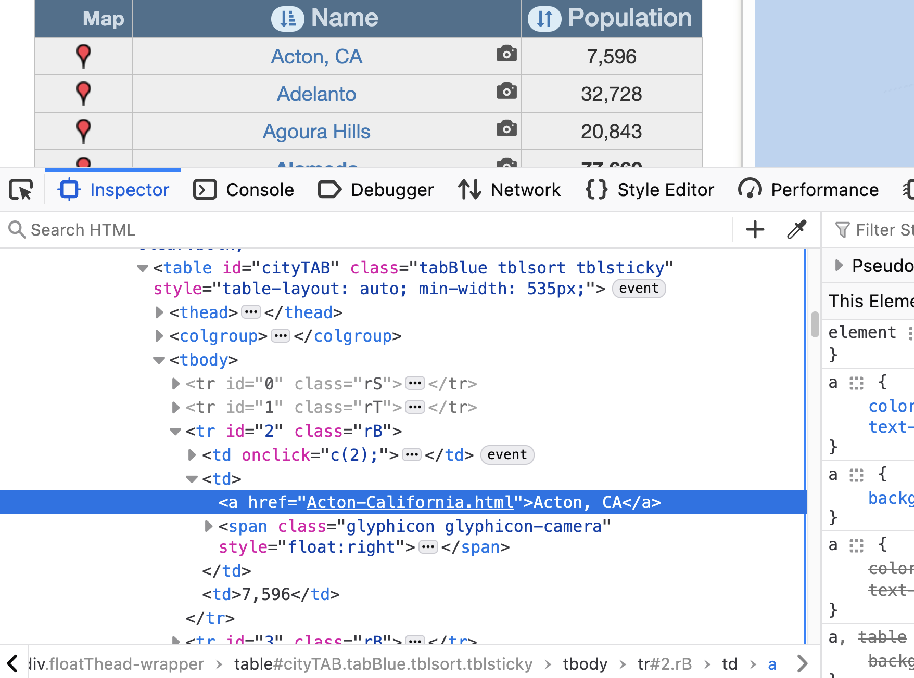

## Day 17


+ [R session - code and output](Rsession)
+ [R commands](code.R)


### city-data.com

+ I started by noting that the jobs we are scraping for the current assignment
  have the city but not the state.
   + We would like to add the state.
   + I would also like to get information about each city we see in the collection of jobs
     such as
	  + median household income
	  + population size
	  + cost of living
	  + demographic information

+ We want a list of all cities in all states.
   + We hope to be able to match the job's city to get the state.
   + There will be multiple matches, but hopefully these are rare and few.
      + Hopefully we can 

+ We can google "list of US cities"
   + we have to decide which source to pursue

+ I already now about one possible site - [city-data.com](https://city-data.com)

 


#### Getting the links for individual city pages for a state.

+ Let's start by getting a list of the cities for California
   + See [https://www.city-data.com/city/California.html](https://www.city-data.com/city/California.html)

+ There are 3 items in the pull-down menu
   + bigger cities
   + smaller cities
   + very small towns and villages

+ We want all of these
   + we may have to mimic clicking on each item to see the HTTP request.


+ Let's inspect the Acton element at the top of the table.
   + Use the Inspector tab in the developer tools.
   + 
   
+ The information for Acton is in a table.

+ Let's use `readHTMLTable()` that we saw last week, but first we have to fetch the document
  + We'll try `readLines()`  and if that fails, we'll use a more sophisticated way to 
     make an HTTP request, e.g., `getURLContent()`.

```{r}
ll = readLines("https://www.city-data.com/city/California.html")
doc = htmlParse(ll)
```   

+ Worked, so now `getHTMLTables()`

```{r}
tbls = readHTMLTable(doc)
length(tbls)
```

+ So 9 tables. Which one do we want?
```
sapply(tbls, nrow)
```

+ But let's find a better way to find the table of interest.
  + Let's see if the table itself has an attribute that uniquely identifies it.
  + Use XPath to find all table nodes.
```{r}
xpathSApply(doc, "//table", xmlAttrs)
```
  + xpathSApply()  is the same as `lapply(getNodeSet(doc, "//table"), xmlAttrs)`
     + i.e., perform the XPath expression and apply the function to each resulting node.

+ The last one - the one we want - has an `id` attribute with a value `cityTAB`.
  + Use this to get the table and then process just it.
  
```{r}
tbl = readHTMLTable(getNodeSet(doc, "//table[@id = 'cityTAB']")[[1]])
```

#### Get the link to each city

Above, we read the table of city names and population sizes.
However, we want the link to each city.


+ `readHTMLTable()` won't do this for us.

+ In the screenshot for inspecting the Acton element, we see the
```
<a href="Acton-California.html">Acton, CA<a>`
```
  within the td (table data) element, within the tr (row) element, etc.

+ We can get the `<a>` nodes in the table with 
```{r}
a = getNodeSet(doc, "//table[@id = 'cityTAB']//a")
```

+ We can extract the link and the name of the city

```{r}
clnk = structure(sapply(a, xmlGetAttr, "href"), 
                 names = sapply(a, xmlValue))
```

#### Get the links on the front page to each state's list of cities

Next we want to get the
 + names of the cities for each state,
 + the links to the page for each city in each state.


We read the entry page

```{r}
ll2 = readLines("https://www.city-data.com/")
doc2 = htmlParse(ll2)
```

We find the link(s) to `New Jersey`
```{r}
nj = getNodeSet(doc2, "//a[contains(., 'New Jersey')]")
length(nj)
sapply(nj, xmlName)

nj = getNodeSet(doc2, "//a[contains(., 'New Jersey')]/..")
xmlAttrs(xmlParent(xmlParent(nj[[1]])))
xmlAttrs(xmlParent(xmlParent(nj[[2]])))
```


Get the a nodes within
```{r}
a = getNodeSet(doc2, "//a[@class = 'cities_list']")
```

We want the links, but also the names of each "state"
```{r}
lnk = sapply(a, xmlGetAttr, "href")
names(lnk) = sapply(a, xmlValue)
```

We get 104 elements.
+ 50 states 
+ District of Columbia
+ and a link for small towns.

Why 104?
```{r}
table(table(lnk))
```
Each one has a single duplicate. 
The difference is the contents within each a node, e.g., CA or California.
We can remove the duplicates
```
lnk = lnk[!duplicated(lnk)]
```

However, with some exploration, we can find that the abbreviated versions (AL, AK, CA,...)
are in an `<ul>` that has a `style` attribute with a value `display:none;`.
So we can omit these in our XPath expression with
```{r}
a = getNodeSet(doc2, "//a[@class  = 'cities_list' and not(ancestor::ul[@style='display:none;'])]")
```

We could also write this as
```{r}
a = getNodeSet(doc2, "//ul[not(@style = 'display:none;')]//a[@class  = 'cities_list']")
```
This doesn't go back-up the tree to check the ancestor of each `a` node.
It doesn't descend any `ul` node that has this `style` attribute value.

So now we can get the named vector of URLs
```{r}
a = getNodeSet(doc2, "//ul[not(@style = 'display:none;')]//a[@class  = 'cities_list']")
lnk = structure(sapply(a, xmlGetAttr, "href"), names = sapply(a, xmlValue))
```

We drop the "Small towns" link:
```{r}
lnk = lnk[-length(lnk)]
```


###

We now have an approach to get
  + all the city names in each state (and DC).
  + the links to each of these cities.

